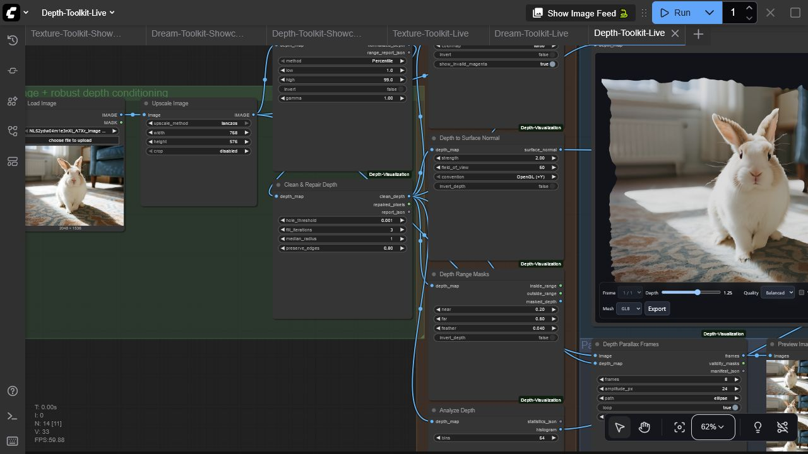

# ComfyUI Depth Visualization

A complete offline depth-conditioning, diagnostics, 3D export, and parallax toolkit for ComfyUI. It cleans and normalizes arbitrary depth maps, creates masks, normals and colormaps, measures quality, exports real geometry, generates motion frames, and previews depth interactively in the graph.



## Nodes

| Node | Purpose | Outputs |
| --- | --- | --- |
| **Depth Viewer Pro** | GPU-accelerated displaced-mesh preview with adaptive quality | image/depth passthrough + live UI |
| **Normalize Depth** | Percentile, min-max, or fixed-range normalization with gamma/invert | normalized depth + JSON report |
| **Clean & Repair Depth** | Fill invalid holes and reduce noise while preserving edges | clean depth, repair MASK, report |
| **Colorize Depth** | Viridis, magma, turbo, plasma, or grayscale visualization | IMAGE |
| **Depth to Surface Normal** | Camera-aware normal generation with OpenGL/DirectX convention | normal map |
| **Depth Range Masks** | Feathered near/far selection | inside MASK, outside MASK, masked depth |
| **Analyze Depth** | Per-batch statistics and histogram rendering | JSON + histogram IMAGE |
| **Depth to Point Cloud** | Binary PLY export with optional colors | file paths + manifest |
| **Depth to Mesh** | Zero-dependency binary glTF 2.0 GLB export with optional colors | file paths + manifest |
| **Depth Parallax Frames** | Horizontal, vertical, ellipse, or dolly camera motion | IMAGE batch, validity MASK batch, manifest |

## Viewer highlights

- Orbit, pan, zoom, positive/negative displacement, reset, and wireframe
- Fast, balanced, and high adaptive mesh density
- Batch selection with single-image broadcasting
- PNG capture and baked GLB, GLTF, or OBJ export
- Lazy/offscreen rendering, bounded pixel ratio, stale-load cancellation, cleanup, and WebGL context recovery
- Local pinned Three.js r185 assets; no runtime CDN or telemetry

## Install

Install with ComfyUI Manager, or clone manually:

```bash
cd ComfyUI/custom_nodes
git clone https://github.com/gokayfem/ComfyUI-Depth-Visualization.git
python -m pip install -r ComfyUI-Depth-Visualization/requirements.txt
```

Restart ComfyUI. Nodes are under `visualization/3D` and `depth/toolkit`.

## Start with the live example

Load [`examples/workflows/Depth-Toolkit-Live.json`](examples/workflows/Depth-Toolkit-Live.json), select a reference image and depth map, and queue it. The bundled demonstration uses image luminance as stand-in depth so it runs without a model; replace that connection with any real depth estimator for production work. The API-format version is [`examples/api/depth_toolkit_api.json`](examples/api/depth_toolkit_api.json).

The graph normalizes and repairs depth, renders a diagnostic colormap and surface normals, extracts range masks, produces a histogram, generates loopable parallax frames, and opens the live displaced-mesh viewer. Point-cloud and GLB exporters can be added anywhere after cleanup.

## Geometry conventions

- Depth is interpreted in normalized `[0, 1]` space after conditioning.
- Export nodes use a pinhole camera model and configurable field of view/depth scale.
- GLB is the recommended portable mesh format; binary PLY is recommended for point clouds.
- `validity_masks` from parallax indicate pixels not introduced by camera warping and can drive compositing/inpainting.

## Compatibility and performance

- Python 3.10+; tested in CI on Linux, Windows, and macOS
- Real ComfyUI test: ComfyUI 0.3.60, frontend 1.26.13, Windows, NVIDIA RTX 3090
- Conditioning/export nodes run deterministically on CPU tensors; the live viewer uses browser WebGL and is independent of CUDA, ROCm, or MPS
- 16-bit grayscale temp previews preserve depth precision; browser mesh quality is selectable to control GPU load
- No runtime network requests; images and geometry stay local

## Development

```bash
python -m pip install -r requirements.txt pytest build
python -m compileall -q .
pytest -q
python -m build
node --check web/viewer_extension_3_0.js
node --check web/js/threeVisualizer.mjs
```

The vendored Three.js files are MIT licensed; see `web/vendor/THREE-LICENSE.txt`. See [`SECURITY.md`](SECURITY.md) for privacy and disclosure guidance.

<details>
<summary><strong>Cite this project</strong></summary>

If ComfyUI Depth Visualization supports your work, GitHub provides ready-to-copy
APA and BibTeX entries via **Cite this repository**.

```bibtex
@software{Aydogan_ComfyUI_Depth_Visualization_2026,
  author  = {Aydoğan, Gökay},
  title   = {ComfyUI Depth Visualization},
  version = {3.0.0},
  year    = {2026},
  url     = {https://github.com/gokayfem/ComfyUI-Depth-Visualization}
}
```

[ORCID](https://orcid.org/0000-0002-2343-9433) · [Citation metadata](CITATION.cff)

</details>

## Acknowledgements

The original viewer was inspired by
[ComfyUI-Flowty-TripoSR](https://github.com/flowtyone/ComfyUI-Flowty-TripoSR).
